<div align="center">


<a href="https://github.com/Dems-dev">
  
</a>

<p>
  <a href="https://www.linkedin.com/in/dhimasagung-dp/"></a>
  <a href="mailto:dhimasagung2004@gmail.com"></a>
  
</p>

</div>

<br/>

<div align="center">
  
</div>

<br/>

## ⚡ What I Bring

```diff
- Data scattered across dozens of Excel files
+ One integrated Odoo system, one source of truth

- Online orders re-typed manually into the warehouse
+ Website order → Sales → Inventory → Invoice, fully automated

- "Standard Odoo can't do that"
+ Clean, upgrade-friendly custom modules that fill the gap
```

## 🚧 Building in Public

Open-source Odoo 19 modules built for Indonesian businesses, one shipped at a time.

| Project | What it does | Status |
| :-- | :-- | :-: |
| [**odoo19-dev-docker**](https://github.com/Dems-dev/odoo19-dev-docker) | One-command Odoo 19 + PostgreSQL dev environment with backup & restore scripts |  |
| [**odoo-terbilang-id**](https://github.com/Dems-dev/odoo-terbilang-id) | Amount in Indonesian words (*terbilang*) on invoices & quotations |  |
| [**website-whatsapp-product**](https://github.com/Dems-dev/website-whatsapp-product) | "Order via WhatsApp" button on product pages, with product name & link |  |
| [**l10n-id-address**](https://github.com/Dems-dev/l10n-id-address) | Province → City → District dropdowns for contacts & website checkout |  |
| [**odoo-til**](https://github.com/Dems-dev/odoo-til) | Daily notes: ORM, QWeb, OWL & website tricks I learn on the job |  |

## 🛠️ Tech Stack

<div align="center">


<br/><br/>


</div>

## 🐍 Contributions

<div align="center">
<picture>
  <source media="(prefers-color-scheme: dark)" srcset="https://raw.githubusercontent.com/Dems-dev/Dems-dev/output/github-snake-dark.svg?v=3"/>
  <source media="(prefers-color-scheme: light)" srcset="https://raw.githubusercontent.com/Dems-dev/Dems-dev/output/github-snake.svg?v=3"/>
  
</picture>
</div>

<br/>

<div align="center">

<i>"Good ERP is invisible — users just feel their work got easier."</i>


</div>
