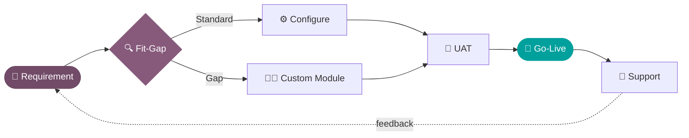

<div align="center">


<a href="https://github.com/Dems-dev">
  
</a>

<p>
  
  <a href="https://github.com/Dems-dev?tab=followers"></a>
  
</p>

</div>

<br/>

## 📦 `__manifest__.py`

```python
# -*- coding: utf-8 -*-
{
    "name": "Dhimas Agung Dwiputra",
    "version": "19.0.2004.1",
    "summary": "Odoo Implementor who turns requirement docs into working systems",
    "category": "Human/Developer",
    "author": "Dems-dev",
    "website": "https://www.linkedin.com/in/dhimasagung-dp/",
    "license": "LGPL-3",
    "depends": [
        "kopi_susu",         # ☕ runtime dependency, non-negotiable
        "curiosity",
        "website_sale",
        "sale_management",
        "stock",
    ],
    "data": [
        "views/clean_ux.xml",
        "security/zero_bugs_in_prod.xml",  # ...we try 😅
    ],
    "assets": {
        "web.assets_frontend": ["dhimas/static/src/**/*"],
    },
    "currently_building": "B2B/B2C e-commerce on Odoo 19 (Odoo.sh)",
    "learning": ["OWL framework deep-dive", "Odoo performance tuning"],
    "ask_me_about": ["Odoo website & eCommerce", "Custom modules", "QWeb templates"],
    "installable": True,
    "application": True,
}
```

## 🖥️ Boot Log

```console
$ ./odoo-bin -d life -u dhimas --dev=all
INFO life odoo.modules.loading: loading 1 modules...
INFO life odoo.modules.loading: Loading module dhimas (Odoo Implementor)
INFO life odoo.modules.registry: module dhimas: creating or updating database tables
INFO life odoo.modules.loading: 1 modules loaded in 0.42s, 2004 queries
INFO life odoo.addons.base: skills loaded → python, xml, qweb, owl, postgresql
INFO life odoo.service.server: ✅ Dhimas is ready to build your ERP 🚀
```

## 🔄 Before vs After (what I bring)

```diff
- Data tersebar di puluhan file Excel
+ Satu sistem Odoo yang terintegrasi

- Order online dicatat manual ke gudang
+ Website order → Sales → Inventory → Invoice, otomatis

- "Fiturnya nggak ada di standar Odoo"
+ Custom module yang rapi, upgrade-friendly, dan terdokumentasi
```

<br/>

## 🛠️ Tech Arsenal

<div align="center">


<br/><br/>


</div>

<br/>

## 🧭 How I Work



<br/>

## 📊 GitHub Analytics

<div align="center">


<details>
<summary><b>🏆 Trophy Cabinet</b> (klik untuk buka)</summary>
<br/>

</details>

</div>

<br/>

## 🐍 Contribution Snake

<div align="center">
<picture>
  <source media="(prefers-color-scheme: dark)" srcset="https://raw.githubusercontent.com/Dems-dev/Dems-dev/output/github-snake-dark.svg" />
  <source media="(prefers-color-scheme: light)" srcset="https://raw.githubusercontent.com/Dems-dev/Dems-dev/output/github-snake.svg" />
  
</picture>
</div>

<br/>

## 🤝 Let's Build Something

<div align="center">

<a href="https://www.linkedin.com/in/dhimasagung-dp/"></a>
<a href="mailto:dhimasagung2004@gmail.com"></a>
<a href="https://github.com/Dems-dev"></a>

<br/><br/>

<i>"Good ERP is invisible — users just feel their work got easier."</i>


</div>
