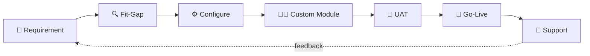

<div align="center">


<a href="https://git.io/typing-svg">
  
</a>

<br/>


</div>

---

### 🧩 `whoami.py`

```python
from odoo import models, fields


class Developer(models.Model):
    _name = "dhimas.developer"
    _description = "Odoo Implementor who actually reads the requirement doc"

    name        = fields.Char(default="Dhimas")
    role        = fields.Char(default="Odoo Implementor")
    location    = fields.Char(default="Jakarta, Indonesia 🇮🇩")
    current     = fields.Char(default="Shipping a B2B/B2C e-commerce on Odoo 19 (Odoo.sh)")
    stack       = fields.Many2many(default=["Python", "XML", "OWL/JS", "QWeb", "PostgreSQL"])
    focus       = fields.Selection([
        ("website",  "Website & eCommerce"),
        ("sales",    "Sales & Inventory flows"),
        ("custom",   "Custom modules & integrations"),
    ], default="website")
    fun_fact    = fields.Text(default="I debug faster with a cup of kopi susu ☕")

    def action_build(self):
        return "Requirement ➜ Fit-gap ➜ Config ➜ Custom ➜ Test ➜ Go-live 🚀"
```

---

### 🛠️ Tech Stack

<div align="center">

**ERP & Backend**


**Frontend & Website**


**Tools & DevOps**


</div>

---

### 🔄 How I Work



---

### 📊 GitHub Stats

<div align="center">


</div>

---

### 🤝 Let's Connect

<div align="center">

<a href="https://www.linkedin.com/in/dhimasagung-dp/"></a>
<a href="mailto:dhimasagung2004@gmail.com"></a>
<a href="https://github.com/Dems_dev"></a>

<br/><br/>

> *"Good ERP is invisible — users just feel their work got easier."*


</div>
